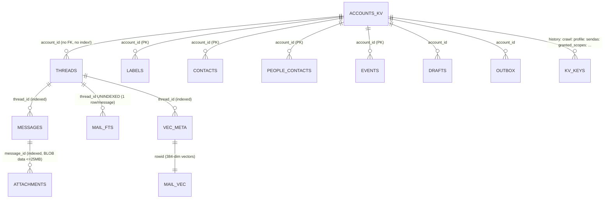
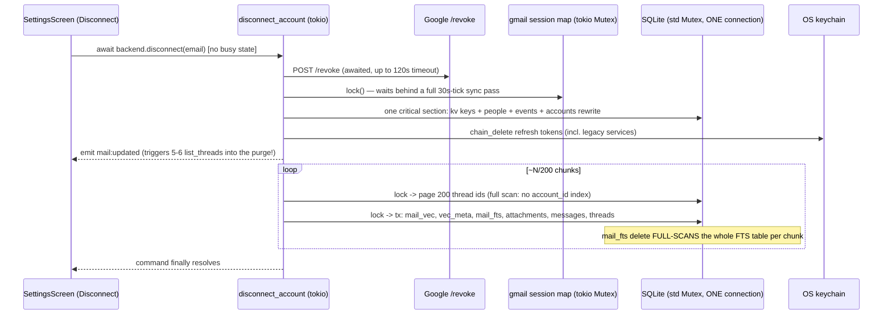

# Root-cause research — 2026-07-24 usage pass

Research only; nothing here is implemented. Companion prompt pack: `docs/PROMPTS-2026-07-24.md`.
Base: `main` @ v0.22.0 (11f1ee2). Every claim below is anchored to a file:line on that revision.

Topics: split inbox (scoping, auto-organize, query syntax) · account removal freeze + grant
health + storage architecture · sync/download progress · settings inventory · demo account ·
helper-text setting · welcome screen / halo · Paper desktop icon · taskbar unread badge ·
uninstall cleanup.

---

## 1. Split inbox

### 1.1 What exists today

The whole feature is ~120 lines. Definitions are a `Split[]` array inside the single global
`Settings` JSON blob (`src/lib/types.ts:45-60`, persisted as one row `kv["settings"]`,
`src-tauri/src/lib.rs:3203`). A split is a flat list of `{field, contains}` rules joined by one
AND/OR — no grouping, no negation, no query string. Membership is computed **at render time** by
`assignSplit` (`src/lib/mock.ts:1626-1652`): first split whose rules match wins, `contains` is a
raw case-insensitive substring test, and the result is derived again on every React render by six
different call sites. Nothing is ever written to the DB or to Gmail.

### 1.2 Root cause — splits apply across all accounts

There is **no account id anywhere in the model, storage, or evaluation**. `splits` lives in the
global settings blob; `get_settings` takes no account argument (`src-tauri/src/lib.rs:3188`);
`assignSplit(thread, splits)` never consults the active account. Threads are account-filtered
upstream in SQL, but the split *definitions* are global by design — `docs/DECISIONS.md:39`
records it: "splits/KB/AI settings are global across accounts (per-account splits deferred until
someone actually wants them)." Someone now wants them.

### 1.3 Root cause — splits don't auto-organize qualifying mail

Four compounding causes:

1. **First-match-wins with `Important` pinned first and no reorder UI.** Custom splits are
   inserted *after* the built-in Important split (`SettingsScreen.tsx:726-728`), so any thread
   Gmail tagged `IMPORTANT` is claimed by Important and can never reach your custom split. The
   settings UI has no reorder control, so this is unfixable from the app.
2. **A thread belongs to exactly one split** — `assignSplit` returns a single id. Superhuman's
   "also show in Important or Other" semantics are structurally impossible.
3. **Splits only ever see the newest 500 inbox threads** (`LIMIT 500`,
   `src-tauri/src/store/mod.rs:600`, and the inbox is not paged). Older or archived mail is
   invisible to every split, so "existing mail isn't categorized" is literally true.
4. **Nothing is persisted.** No DB column, no sync-time pass, no Gmail label/filter. "Organize"
   means "a substring filter runs during render."

Secondary defects: `field:"to"` is silently an alias for `from` because `Thread.participants`
holds senders only (`src-tauri/src/mail/sync.rs:434`); Gmail `CATEGORY_*` labels are stripped at
sync (`sync.rs:458`) so a Promotions/News-style split can't be expressed; deleting the active
split leaves `activeSplitId` dangling, which renders an empty inbox and can even record a bogus
inbox-zero streak (`src/stores/ui.ts:390-402`).

### 1.4 Root cause — `from:thriftytraveler.com OR from:…` matches nothing

**There is no query parser.** The Definition box is a plain "contains" input; the entire pasted
string becomes one literal needle:

```
needle = "from:thriftytraveler.com or from:thepointsguy.com or …"   // 100+ chars
matched = participants.some(p => p.toLowerCase().includes(needle))  // never true
```

(`src/lib/mock.ts:1636-1645`; identical logic duplicated in Rust at
`src-tauri/src/lib.rs:2977-3003`.) The split saves silently and shows a 0-count tab.

Aggravating factors:

- **The read view teaches a syntax the write view can't parse.** Saved rules are *displayed* as
  `from:"…" OR from:"…"` (`SettingsScreen.tsx:748-752`) — exactly the Superhuman syntax that
  fails when typed back in.
- **A real Gmail-operator parser already exists** — `src-tauri/src/search.rs:81-104`
  (`parse_deterministic`: `from:`/`to:`, quoted phrases, date ops, tests included) — and splits
  don't use it. Search speaks Gmail; splits speak `String.includes`.
- No validation: an unmatchable rule is accepted without feedback.

### 1.5 Staff-level review notes

- The **sole TS implementation of core domain logic lives in the mock backend**
  (`src/lib/mock.ts`) and production code imports it from there (`src/stores/mail.ts:3`).
- The TS and Rust matchers are duplicated and **already divergent** (unknown `field` → falsy in
  TS, matches-participants in Rust, `lib.rs:2994`).
- Evaluation cost is O(splits² × threads × rules) per render with fresh string allocations —
  ~1.15M `toLowerCase().includes()` ops per render at the caps — and zero memoization.
- Front end must *predict* the Rust matcher's result to build undo entries for Get-Me-To-Zero
  (`ZeroSweep.tsx:20-29`): two evaluators plus a prediction of one of them.
- **Zero test coverage** on both sides.

### 1.6 Recommended target architecture (for the rework prompt)

- **Real query language, one implementation.** Extend `search.rs::parse_deterministic` into a
  boolean AST (`from:`/`to:`/`subject:`/`label:`/`list:`, OR/AND, parens, quotes, bare-domain
  semantics that match the *address domain*, not the display string) and make it the single
  matcher, exposed to TS via IPC or compiled result. Kill the duplicated TS matcher.
- **Materialize membership at sync time.** `split_id` (plus optional "also show in" flags)
  computed on upsert in Rust, stored on the thread row, re-classified by a background pass when
  definitions change. Fixes the 500-row window, gives SQL counts for tabs, makes membership
  consistent between UI and `bulk_archive`.
- **Per-account scoping** — `accountId: string | null` on each split (null = every account),
  which migrates cleanly from the existing global array.
- **Ordering is user data.** Reorderable list; custom splits default *above* Important; a
  per-split "also show in Important/Other" checkbox (Superhuman parity).
- Preserve `CATEGORY_*` labels at sync so category-driven splits are expressible; add recipient
  addresses to the thread model so `to:` works.

---

## 2. Account removal, grant health, and how mail is stored

### 2.1 Storage map (what the app actually persists)

One shared SQLite file for all accounts — `app_data_dir/fission.db` — opened once into a single
`rusqlite::Connection` behind a `std::sync::Mutex` (`src-tauri/src/lib.rs:25`, `:3500`). WAL is
on; `foreign_keys=ON` is declared but **no table declares a foreign key**, so there is no cascade
— every dependent row is deleted by hand. Tokens are in the OS keychain (service `SnailMail`,
with legacy `FissionMail`/`ZenBoxMail` read-through), never in SQLite.



Outside SQLite: OS keychain entries (`gmail:refresh_token:{email}`, legacy shared
`gmail:refresh_token`, client id/secret, AI keys), `app_cache_dir/attachments/<filename>` (no
per-account dir, never cleaned, collisions overwrite), `app_data_dir/models` (embedding model),
and in-memory Zustand caches (`labelCache`/`threadCache`, `src/stores/mail.ts:16-27`) that are
**not invalidated on disconnect**.

### 2.2 The disconnect flow and why it froze



**The original crash/freeze** (pre-c197226): the purge ran per-thread — six autocommit fsyncs ×
34k threads — inside one lock hold, for minutes. 30 of the 74 IPC commands are *synchronous*,
which in Tauri 2 means they execute inline on the **main/event-loop thread**
(verified in `tauri-macros` codegen; `get_accounts`, `list_threads`, `get_settings`,
`search_threads`… all take `state.db.lock().unwrap()`). Main thread blocks → Windows "Not
Responding" → user kills the app → half-state, because token revoke + keychain delete had
already happened *before* the purge.

**What c197226 fixed:** chunked the purge (200 threads/batch, lock released between), moved token
deletion after the accounts-list rewrite, added a boot orphan sweep, killed "token resurrection"
(legacy keychain copy-forward), preserved Google's error body so `invalid_grant` is classifiable,
and stopped the 30s tick from swallowing sync errors.

**What it did not fix (why disconnect is still slow and janky):**

1. **The FTS delete is quadratic.** `mail_fts` is contentful FTS5 keyed only by
   `thread_id UNINDEXED` (`store/mod.rs:74-79`), so `DELETE … WHERE thread_id IN (…)`
   (`store/mod.rs:1239`) full-scans the *entire* message index — both accounts — on **every
   batch**. ~170 batches × full scan. Chunking shortened each lock hold but multiplied scans.
   Fix shape: key FTS rows by `messages.rowid` and delete by rowid (O(row) in FTS5), or use
   external-content FTS with delete triggers.
2. **`threads` has no index on `account_id`** — paging, counting (`emit_sync_progress` calls
   `count_threads` on every stream beat), listing, and the orphan sweep all full-scan.
3. **The command still awaits the entire purge** (`lib.rs:366`) and the UI has no busy state, no
   confirmation, no progress, no double-click guard (`SettingsScreen.tsx:300-311`), no `.catch`.
4. **Main-thread architecture unchanged** — every ~1s chunk still stalls synchronous commands;
   the `mail:updated` emitted *before* the purge schedules 5-6 `list_threads` right into the
   contention. All 30 sync commands should become `async` (thread-pool) and/or reads should move
   to a separate connection (WAL already permits concurrent readers).
5. **Blocking preamble**: awaited `/revoke` (up to 120s) and the gmail-map lock (waits behind a
   whole sync pass) both precede any UI change.
6. **Leftovers on disconnect**: `contacts`, `labels`, `drafts`, `outbox` rows;
   `profile:`/`history:`/`crawl:`/`threads_total:`/`invite_miss:` kv keys;
   `settings.signatures[email]`; on-disk attachment cache; in-memory thread caches. The orphan
   sweep only looks at `threads`.
7. **Disk never shrinks** — no `VACUUM`/`auto_vacuum`; a 5 GB file stays 5 GB forever.
8. **Reconnect-for-scopes nukes the mailbox** (`SettingsScreen.tsx:177-193` calls disconnect →
   OAuth), and because `history:{email}`/`crawl:{email}` *survive* the purge, the reconnected
   account resumes from a stale cursor over an empty store — incremental sync against a baseline
   that predates the wipe, and the crawl may be marked `done` so history is never re-walked.
9. **Queued outbox mail on a dead account is silently destroyed** — delivery fails, attempts
   count to 5, row deleted (~15s), only an `eprintln!`.
10. The shared legacy keychain entry (`gmail:refresh_token`) is both a cross-account read hazard
    and is deleted unconditionally on any account's disconnect (`lib.rs:361`).

### 2.3 Grant health ("how do I know an account needs reconnecting?")

Detection: only the token-refresh endpoint's `invalid_grant` is classified, and only in two of
the ~10 sync entry points (30s tick, `sync_in_background`). The boot reconcile still swallows
errors (`if let Ok(c) = full_sync(...)`, `lib.rs:3621`); `sync_now`, `resync_account`, calendar,
people, crawl, and outbox never classify. A Google-side revoke invalidates the *access* token
immediately, but 401s are not retried-with-refresh and don't match `is_auth_revoked`, so
detection latency is up to ~1 hour.

Surfacing: on the connected→disconnected flip, one 2.6-second toast, once ever (restart re-detects
but never re-notifies). The only persistent indicator is a 2 mm amber dot in Settings →
Accounts — and the Zustand accounts list is only refreshed on app start or explicit
connect/disconnect, so **the dot doesn't appear in a running app at all**. The header dot is
hardcoded green (`App.tsx:296`). The "Reconnect" strip is gated on *missing scopes*, not on
`connected` — `granted_scopes:` survives `mark_auth_lost`, so the one affordance with a real CTA
is hidden exactly when the grant dies.

### 2.4 Architecture options for fast account removal

| Option | Delete cost | Trade-offs |
|---|---|---|
| A. Tombstone + background purge | UI-instant; purge is async | Mark account `removing`, return immediately, hide from all queries via account filter; background task purges with progress events; boot sweep is the crash-recovery. Needs FTS-by-rowid fix + `threads(account_id)` index to make the background work cheap. |
| **B. Per-account SQLite files** — **owner's pick, 2026-07-24** | O(1) — close + delete file | True isolation, small FTS indexes, instant "delete account", per-account vacuum for free. Costs: cross-account search must fan out (or keep a thin global index), migrations run per file, one-time migration of the existing 5 GB db, connection management. Prompt 2 in the pack builds this. |
| C. Single db + `ON DELETE CASCADE` FKs | Same total work, less code | Still scans without the FTS fix; still blocks without async commands. Not sufficient alone. |

Either way: run `PRAGMA incremental_vacuum` (or scheduled `VACUUM`) after purge so disk is
reclaimed, sweep the attachment cache dir, clear the in-memory caches on disconnect/switch, and
make removal idempotent.

---

## 3. Sync / download progress ("show me 1, 2, 3 … of 30")

### 3.1 What exists

One event, `sync:progress {indexed, total, done}`, emitted from a single function that reads
**persisted state** — `COUNT(*) FROM threads` vs. kv `threads_total` vs. crawl-cursor `done`
(`src-tauri/src/lib.rs:1578-1596`) — and one consumer, the footer strip "Downloading mail
history… N%" (`App.tsx:435-443`). It measures *crawl completeness*, not activity: it can show
while nothing is downloading and never shows once the initial crawl finishes, no matter how much
is being fetched.

### 3.2 Root cause of "no live count"

The counts the owner wants **already exist in Rust and are thrown away**. The fetch loop
(`fetch_streaming`, `src-tauri/src/mail/sync.rs:295-318`) knows `ids.len()` (the exact "of 30")
and the loop index (the exact "1, 2, 3…"), but the progress callback is a **zero-argument
`Fn()`** — the consumer re-derives a worse number with a SQL COUNT. Same story in the
incremental path (`affected.len()`, never surfaced — and `on_progress` is never even passed to
it), the crawl beat (`CrawlBeat{fetched, skipped, …}` goes to `eprintln!`), the embed beat, and
`bulk_archive`. Notably **every Gmail round-trip is one thread fetch** (`threads.get?format=full`
— no batch endpoint in use), so "downloading X of N" maps 1:1 onto HTTP requests already.

Silent paths with zero UI today: the 30s incremental sync (the common case), post-crawl
reconciles (footer permanently hidden once `done` is sticky — nothing ever resets
`CrawlCursor.done`, not even Repair Mail), `sync_now`, onboarding's first sync (the footer
doesn't exist before the app shell renders), `resync_account` (the heaviest download in the
app), background revalidation from the cache-first nav work, and bulk archive.

Known quality bugs in the existing bar: numerator counts all local threads (incl. trash/demo)
while the denominator is Gmail's `threadsTotal` (incl. spam/drafts the crawl excludes) — the
percentage asymptotes below 100 and is clamped to 99 to hide it (`App.tsx:110`); multi-account
sums make one fresh account read as "95% done"; `sync:progress` has no throttle and re-renders
the whole App tree per event.

### 3.3 Recommended shape (for the prompt)

Add a second, activity-scoped event (keep the completeness bar): `sync:activity
{account, stage, done, total}` emitted **time-coalesced in Rust** (max ~4/s), produced by
widening `on_progress` to carry counts (~8 call sites). Consume it in a leaf component (not the
App root): a subtle transient pill — "Downloading 17 of 30…" — that appears when a pass starts
and fades when it completes, with a minimum-display threshold so 2-thread incremental ticks
don't flicker. Add a pull command (`get_sync_progress`) so a late-subscribing UI can't miss
state. Fix the denominator mismatch and reset `crawl:` on Repair Mail while in there.

---

## 4. Settings, demo account, helper text

### 4.1 Settings inventory (why it feels like a mess)

Full inventory lives in the research transcript; structure in one paragraph: a flat 7-tab nav
(`account | ai | knowledge | splits | shortcuts | celebration | appearance`,
`SettingsScreen.tsx:20-28`) with ~40 controls, **no search** (72 remappable shortcuts render as
one unsearchable flat list), and three different save models on the same screen (instant-save,
explicit Save buttons, Enter-to-commit). "Appearance" is a junk drawer: theme + notifications +
undo-send timing + Drive upload policy + tour replay + the **Unsplash API key** + app updates.
Signatures (a rich HTML editor) are buried three levels deep inside each account row. Streaks —
read-only telemetry — render inside a preferences surface. **Five real settings are unreachable
from Settings entirely** (`showShortcutBar`, `calendarOpen`, `hiddenCalendars`, `sidebarOpen`,
`driveShareMode`). Dead controls ship (a permanently disabled "Add Outlook account" button); the
raw `<input>`/`<select>` styling ignores the design-system `Button`/`Input` components; and the
tab state is a raw `string` with no fallback, so a typo renders a blank pane.

Also structural: every keystroke in any settings field serializes and writes the **entire**
settings blob through IPC (`stores/settings.ts:72-76`), optimistically, with no rollback on
rejection — and the backend *can* reject (>24 splits).

### 4.2 Demo account (why it ships, what removal touches)

Demo mode is not a leftover — it is the app's **zero-account state**. The Rust store's
`get_accounts` falls back to two fake accounts (`demo@fission.local`, `angel@fission.local`,
`src-tauri/src/store/mod.rs:242-266`); a fresh desktop install boots "signed in" to them; demo
fixtures are **written into the user's real SQLite db** on first boot (`seed_if_empty`);
disconnecting your last real account deliberately re-seeds demo. The onboarding screen
advertises "Explore the demo first" in the desktop build, both demo accounts appear in the
account switcher, and there is **no UI to remove them** (Disconnect is gmail-gated). The mock
backend is a static import in the shipped bundle (~43 KB min / ~15 KB gzip measured).

The seam for removal has five anchors: (1) the front-end `isTauri` backend ternary with its
static `MockBackend` import (`src/lib/ipc.ts:40,233,661`); (2) the Rust default-accounts
fallback; (3) boot/disconnect fixture seeding (`lib.rs:347,372,3425-3449`); (4) the onboarding
CTA; (5) ~26 `provider != "gmail"` / `is_mock_id` branches. **Removal requires designing the
missing zero-account state** (what does the desktop app show with no accounts connected?) plus a
migration to purge already-seeded demo rows from existing installs — while keeping the browser
demo (`npm run dev`) fully working via a build-time split, since the runtime `isTauri` check
can't tree-shake anything.

### 4.3 Helper-text setting compliance

The setting is `showShortcutBar` (`types.ts:115-116`, default true) — deliberately scoped to the
bottom footer only (`docs/DECISIONS.md:95`), toggled only by an *unbound* palette command named,
misleadingly, "Toggle Shortcut Hints", and not exposed in the Settings UI at all.

Compliance tally: **1 surface respects it** (the footer). Ignoring it: 21 `HoverHint` call
sites, 19 hardcoded inline hint strips — including the reported "`Tab` to switch"
(`MailScreen.tsx:126-137`) and "`E` done · `R` reply · `H` snooze" (`ThreadView.tsx:625-628`) —
6 live-resolved surfaces (sidebar chord chips, palette row hints), and 13 bare `title=` key
hints. The `Kbd` component is dead code; everyone uses a raw `.kbd` span. Several hints also
hardcode keys that are remappable (the settings screen itself lies if you remap Alt+N).

Decision needed: one boolean for everything vs. footer/hover split; and whether `title=`/aria
fallbacks stay (recommended: visual chips obey the setting, accessibility attributes stay).

---

## 5. Shell: welcome screen, halo, Paper icon, unread badge, uninstall

### 5.1 Welcome / sign-in screen

There is no standalone sign-in screen — the sign-in button lives inside step 1 of the 4-step
onboarding flow (`src/features/onboarding/Onboarding.tsx`, mounted from `App.tsx:223-229` when
`!onboarded`). Current look: a flat `bg-base` background (no photo, no gradient, no card), a
560px centered column, brand mark + "Snail Mail" text row, headline below it. The Superhuman
reference layout (centered white card on a photographic background, wordmark *above* the card)
does not exist in the design system either — `design/readme.md` lists onboarding as "in
progress" with no spec, and the repo contains no photographic asset for it. The bottom wash is
*not* rendered on this screen, so the "halo" complaint is about the main app (next section).

Implementation notes for the redesign: the `isTauri` guard on the Connect button
(`Onboarding.tsx:113-121`) must survive (it's what keeps the browser demo honest), the CSP
already allows remote `img-src`, but a first-run screen can't assume network or an Unsplash
key — bundling a committed photo is the safe default, with the existing Unsplash pipeline
(`src-tauri/src/unsplash.rs`) as an optional refresh-once-online enhancement.

### 5.2 The "light blue halo/gradient at the bottom"

Identified with high confidence: `src/App.tsx:256-262` — a fixed 300px-tall,
`pointer-events-none` overlay painting `var(--wash-bottom)`, a bottom-anchored cerulean
gradient (hue 222 ≈ light blue, with a green whisper at the very bottom;
`src/styles/theme.css:118-123` dark / `:199-204` light). It is a deliberate brand element —
`design/readme.md:90` calls it the "signature wash… Snail Mail's calm answer to Superhuman's
peach glow" — and it has history: it was removed once as a bug (`d0e7326`, the light-theme
gradient mixes `%` and `px` stops which CSS clamps into a hard-edged band) and reintroduced in
`11cf1d4` as the current strip. It tints the bottom 300px of every list and reading pane.
Removal touches: the overlay div, the two theme tokens, the `design/tokens/colors.css` mirror
(`:143-146`, `:225-226`), and three `design/readme.md` mentions. Decision needed: delete the
overlay only, or retire the token + design-system identity element entirely.

(No other bottom-anchored blue gradient exists; the only other bottom scrim is the black
legibility fade over inbox-zero photos, `RestState.tsx:87-92`.)

### 5.3 Paper desktop icon

The Claude Design project's `assets/snail-mail-app-tile.svg` is **already the new Paper icon**
(verified via DesignSync: 1024×1024, white `#ffffff` squircle rx 229, rocket-snail art in navy
`#002839` + cyan `#52d0f6` + gold `#fbca60`). The repo's `design/` mirror and `public/` copies
are **stale** — they still hold the old navy tile whose body strokes are `#ecf1f2`
(near-white), which would be invisible on a white ground. The remote standalone mark
(`assets/snail-mail-icon.svg`) was likewise updated to an on-light cut (body `#002839`).

Icon pipeline (manual, documented in `docs/DECISIONS.md:32`): edit
`design/assets/snail-mail-app-tile.svg` → `node scripts/make-icon.mjs` (a zero-dependency
scanline SVG rasterizer producing the committed `scripts/out/icon-source.png`) →
`npx tauri icon scripts/out/icon-source.png` → regenerates all of `src-tauri/icons/` (the
6-frame `icon.ico` used by taskbar/Explorer, the PNG set, plus android/ios trees the app
doesn't ship). No CI step; icons must be committed.

**Pipeline gotcha:** `make-icon.mjs` parses the *old* tile format — a 512×512
`<rect width="512" …>` plus a nested `<svg x y width height viewBox>` — and only M/L/Z path
tokens. The remote Paper tile is 1024×1024 with a `clipPath` and a `<g transform="translate(…)
scale(…)">` wrapper, so the script will throw as-is. Cheapest fix: normalize the mirrored asset
back into the 512/nested-svg format (white ground + the on-light mark), keeping the script
untouched. In-app brand marks (`NavRail.tsx:65-74`, `Onboarding.tsx:9-15`) load
`/snail-mail-icon{,-on-dark}.svg` separately and need the re-mirrored copies too. The
`design/assets ⇄ public` mirror is manual (byte-identical today, verified) — no sync script.

### 5.4 Taskbar unread badge

Tauri is 2.11.5; on Windows the correct API is `Window/WebviewWindow::set_overlay_icon`
(present in this version; `set_badge_count` is explicitly unsupported on Windows). No badge,
tray, or overlay code exists anywhere today. Two gates before it works:

1. **Image decoding features are off** — `Image::from_bytes/from_path` require the `image-png`
   / `image-ico` cargo features, not enabled (`src-tauri/Cargo.toml:18` enables only
   `protocol-asset`). Either add `image-png` or construct raw RGBA (`Image::new_owned`) — for
   a digit badge, drawing RGBA directly in Rust is simple and avoids the dependency.
2. **ACL**: a JS-driven badge would need `core:window:allow-set-overlay-icon` added to
   `src-tauri/capabilities/default.json`. A Rust-driven badge needs no ACL change.

Recommended shape: drive it from Rust, where the exact query already exists —
`notify_new_mail` (`src-tauri/src/lib.rs:1509-1561`) runs
`SELECT … WHERE unread=1 AND in_inbox=1 AND hidden IS NULL` on every sync tick and already
resolves the main window. Hang a badge refresh off the same `mail:updated` funnel (~20 emit
sites) so it can't go stale. Caveat: Rust has no split concept *today*, so "unread in primary
inbox" can only mean the whole inbox until Split Inbox v2 (prompt 1) materializes split ids in
SQL — after which a per-split badge becomes a WHERE clause. A tray icon is a separate,
optional feature (`tray-icon` cargo feature, currently off).

### 5.5 Uninstall cleanup

Config: NSIS only, `installMode: currentUser`, one custom hook (post-install Start-menu
shortcut repair). **Tauri v2 has no `deleteAppDataOnUninstall` config** (verified against
`tauri-utils` 2.9.3 source); the stock NSIS template puts app-data deletion behind an opt-in
checkbox, **unchecked by default**, and its scope when checked is the two identifier dirs +
vendor registry keys. What actually remains after a default uninstall on this machine:

| Left behind | Size / notes |
|---|---|
| `%APPDATA%\com.snail.mail\fission.db` (+WAL/SHM) | **5.1 GB measured** — the entire mailbox |
| `%APPDATA%\com.snail.mail\models\` | ~34 MB embedding model |
| `%LOCALAPPDATA%\com.snail.mail\EBWebView\` | 37 MB WebView2 profile (cookies, localStorage) |
| `%LOCALAPPDATA%\com.snail.mail\attachments\` | decrypted attachment bytes, never pruned, filename collisions overwrite |
| **Windows Credential Manager** | `gmail:refresh_token:<email>`, client id/secret, AI keys, Unsplash key — **nothing ever removes these, checkbox or not**; a live Google refresh token survives "full uninstall" |
| Legacy-brand orphans | `com.zenbox.mail` dirs (~10 MB), `HKCU\Software\fission\…` + old uninstall keys, `*.FissionMail`/`*.ZenBoxMail` credential entries — the rename migrations copy, never clean |

The credential store is the hard part: an NSIS hook can't reach it safely; it needs either the
uninstaller invoking the app binary with a purge flag, or an in-app "Erase all local data"
action (which could also be the pre-uninstall story). Also flagged: `dev-secrets.exe` — a
keychain-writing dev helper — ships in the installed app dir (auto-discovered Cargo bin
target); it should be excluded from release bundles. Any uninstall-hook cleanup must respect
NSIS `$UpdateMode`, because every auto-update runs the same installer in `/UPDATE` mode —
default-on deletion without that guard would wipe the mailbox on every update.

---

## 6. Cross-cutting review themes (staff-level)

1. **The mock is load-bearing.** Domain logic (`assignSplit`) lives in `mock.ts` and production
   imports it; demo mode is the zero-account state; mock parity is maintained by comments in
   three places (TS defaults, Rust defaults, mock migrations). The seam needs to be a real
   interface, not a convention.
2. **Duplicated-by-hand logic across the IPC boundary** — split matching, shortcut defaults,
   concept groups, scope lists — each "kept in sync" by comments, already divergent in one case.
   Anything evaluated on both sides should be evaluated on one side and shipped across.
3. **Main-thread synchronous commands + one DB connection + one unfair mutex** is the structural
   cause of every "app frozen" report so far (docs/DECISIONS.md:151 records a prior instance of
   the same class). Reads can go concurrent under WAL today; commands should be async by default.
4. **Events carry no data** (`on_progress: Fn()`, `mail:updated: ()`), so consumers poll SQL
   under the same contended lock the producers hold. Payload-carrying, coalesced events are both
   faster and simpler.
5. **Missing indexes on the hottest predicates** (`threads.account_id`, FTS deletes by
   unindexed `thread_id`) — cheap migrations, immediate wins.
6. **Settings is a single JSON blob** rewritten per keystroke, mixing device state, user prefs,
   per-account data, and credentials pointers. Splitting it (per-account namespaces, per-key
   writes) unblocks split scoping, per-account signatures, and cheap persistence.
7. **Error paths default to silence** — `eprintln!` for crawl/embed/outbox/sweep failures, a
   single 2.6s toast slot, swallowed boot-reconcile errors. There is no diagnostics surface; the
   planned crash/diagnostic reporter keeps being deferred.
8. **Test coverage is thin exactly where the risk is**: zero tests for splits (both languages),
   the purge path, grant-health classification, or the orphan sweep. The repo has good test
   infrastructure (Vitest + cargo tests) — it's just not pointed at the dangerous code.
